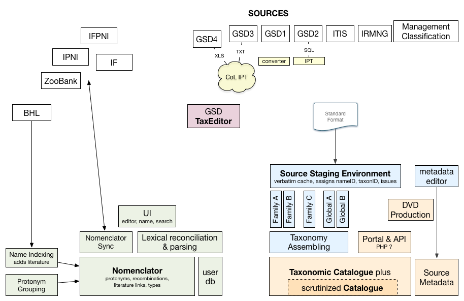
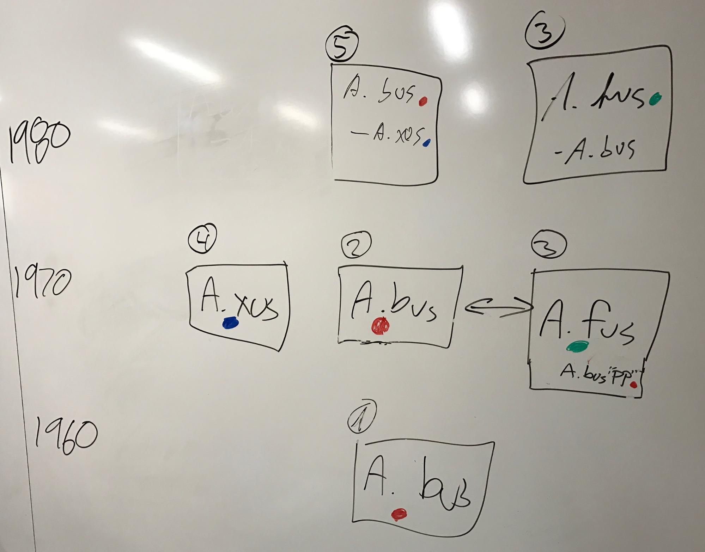

# The Catalogue of Life plus project

The CoL+ project addresses two primary concerns:

 1) The broadening of covered names through deployment of services between GNIndex, Global Nomenclator, Bisby's Catalogue of Life and alternative taxonomic resources can act as a taxonomic backbone for GBIF and similar global activities. (We need to keep in mind that Bisby's CoL has many users otside GBIF and similar global activities). This includes both filling true taxonomic gaps with nomenclatoral  data and alternative resources cross-mapped through GNIndex.

 2)  The migration of all content and social features of the Bisby's CoL to a new infrastructure to address current sustainability and hosting issues. This includes automation of GSD updates and bringing IT tools in editorial process of the Catalogue compilation.
 
## System Overview

## Consolidate GSD publishing
Ideally all (GSD) sources expose their data in the CoL standard exchange format (CoL Data Submission Format at  http://catalogueoflife.org/content/contributing-your-data#ACEF). 
With GSDs managing their data in all kind of custom ways including Word documents, we do not expect to succeed with this ultimate goal. 
Nevertheless CoL+ tries to show some path forward by

 - Defining an updated DwC-A format for exchange (We will learn on how many GSDs will be able to use DwC-A for supplying their data in the CoL AFTER this format will be adjusted to CoL Standard Dataset and documented in a way as it was done for CoL Data Submission Format) 
 - running a shared CoL IPT that GSDs can use to upload spreadsheets and text files (We will learn on how many GSDs will be able to use IPT AFTER all supporting documets/codes will be available)
 - Use the GBIF helpdesk to install IPTs accessing SQL databases on GSD servers (yr: what does it mean?) 
 - Pilot migration to existing taxonomic editing environments (e.g. Species Files yr: Taxon Works?). (yr: this area need further investifgation and clarification) 
 - Pilot migration to a new CoL GSD editor. YR: Failure of development of new environment in 4D4Life project shown that "old way" of CoL assembly and production should be fully operational until new environment will be fully tested, proved as helpful and adopted).

## Unified Nomenclator
CoL+ will create a unified and broadened nomenclator of scientific names across all life that provides an authoritative view and single place of editorial efforts. 
It is intended to track objective information that can be verified from literature and thus lends itself well to collaborative editing and review. 
This allows much better scaling to complete the coverage of all original and subsequently recombined names and tie them to their publication.

#### Names covered [in Global Nomenclator?]
There are different kind of scientific names with different syntactical structures. 
In the first iteration the nomenclator tries to be comprehensive for all:

 - Linnaean names of all ranks
   - Available names
   - Unavailable names
   - Chresonyms	
 - Named hybrids and nothotaxa
 - Virus names

For the time being this will explicitly exclude:

 - Cultivar names
 - Hybrid formulas
 - Well known OTUs (e.g. BOLD Barcode Index Numbers)

#### Organism groups
In order to track new or changed names of certain organism groups the nomenclator must “classify” names to some degree. 
For homonym disambiguation it is also desirable to have some notion of a coarse classification to not just rely on the often missing or variously spelled authorship. 
With the CoL management classification covering all families this seems like a logical option (CoL management classification is a part of the CoL, not an independent database; there is sense to talk about "place in the CoL classification" instead of "family"). 
Other options to be considered include:

 - Original place in the classification as indicated in publication (place in the classification, indication of the type, nomenclatural act and bibliographic reference is an essential part of metadata for each scientific name in the nomenclator)
 - Place in CoL classification
 - A few higher groups at various ranks to break down large groups and discriminate homonyms (?)
 - Nomenclatural code alone 
 - Nothing at all (?)

#### Open editorial web-interface for Nomenclator 

 - Registration model (authenticating the user - not limiting rights) 
 - Track changes (with attribution)
 - Name verification, review
 - Supports annotation (github issues)
 - Incentivisation strategies

## Editorial web-interface for Bisby's CoL 
- Registration model (authorised access only)
- Track changes (with attribution)
- Change verification, review
 
#### Webservice API
 See [Nomenclator API draft](https://sp2000.github.io/colplus/api/nomenclator.html)
 - Lexical namestring matching service taking a name string and an optional classification hint to return matching names from the nomenclator. ACTION: Integrate GNI lexical services into the nomenclator (MD, DM)
 - Name search
 - Homotypic Name reconciliation service: Retrieve all (homotypic) names with the same original name
 - Monitor new/changed names, e.g. for GSDs

#### Exchange with existing nomenclators
Various code specific nomenclators are existing already with which information should be shared bidirectionally if possible. 
A simple way to expose changes since a given date is a possible solution to be explored with the existing nomenclature projects including:

 - ZooBank
 - The International Plant Names Index (IPNI)
 - Index Fungorum (IF) or MycoBank as an authorised name register by ICN?
 - The International Fossil Plant Names Index (IFPNI)
 - Algae (under development)
 - ICTV
 - Prokariotic Nomenclature Up-to-date (DSMZ)

Consider editorial blocking of virus & bacteria names as these are well managed externally already.

#### Suggest content for review
Many interesting facts about a name are building up relations with existing data. 
These can often be discovered by software and proposed to the system for later, manual review.

 - Suggest original name publication in BHL
   - BHL Name Indexing 
   - Query additional non GSD sources: GNUB, BioNames
   - Action:  Scope possible sources and mechanisms for linking literature to a name record.	
 - Suggest links to type specimens in GBIF or JSTOR
 - Suggest original name by looking at shared terminal epithets from the same original author within a family. Implemented already in the GBIF Backbone building.

## Taxonomic web editor
Some GSDs have expressed the wish and need to work in a convenient, collaborative online environment. 
There are some existing tools like [TaxonWorks](http://www.taxonworks.org) (successor of Species Files) and the Aphia database that should be considered to be integrated into the CoL workflow via data exchange services. 
On the other hand a new taxonomic webeditor specifically build for CoL will require considerably less resources 
as there is already a name editing environment in the Nomenclator and a management classification down to families provided. 
A minimum taxonomic collaboration environment would therefore provide an API that covers:

 - Managing all kind of semantic synonyms (i.e. heterotypic synonyms and combinations)
 - Integrate with the Nomenclator
 - Manage taxa of all ranks accepted by CoL Standard Dataset
 - Manage all fields described in CoL Standard Dataset (geographical distribution, ecological environment, common names, etc.)
 - Link refernces accumulated in GSD to BHL and other online resources containning full publication.
 - Manage fossil flag & geological times (changes in CoL Standarad Dataset are necessary if present 3 fields for fossils will be amended by Global Team)   
 - Allow discussions

## New CoL assembly process
Assembly of GSDs and proto-GSDs should be supported by IT tools and editorial intefeces which allow to do data integrity checks, to record, store and automatically re-apply editorial decisions, to do necessary editorial data transformations. 
Updating of GSDs and proto-GSDs should be an automated and repeatable process as much as possible. 
Editorial decisions should be possible to the degree needed and persisted to allow repeated processing. 
The process incorporating data from the standard format into the live CoL can be divided in 3 main parts. 
First, each GSD shall get the data into a staging environment for internal data integrity checks and necessary editorial transformations to fit CoL Standard Dataset
Second, pre-prepared GSD should be inserted in the staging version of the CoL, data integrity checks GSD vs CoL should be performed and necessary editorial transformations should be completed on entite CoL (staging version); product metadata should be adjusted.
Third, staging version of the CoL should be deployed on propduction website (www.catalogueoflife.org/col for monthly editions and www.catalogueoflife.org/annual-checklist/[year] for Annual Checklist)
PS: a) best practice: scientific names and refrences in the CoL should be linked to the existing nomenclators and BHLplus in GSDs. Can CoL+ help GSDs in this task? 
a) fuzzy prcatice: scientific names and refrences in the CoL might be linked to the existing nomenclators and BHLplus via specially design CoL+ services 

#### Source staging environment
In order to evaluate source data, provide initial integrity checks and a unified API to work against all sources a staging environment is planned. 
This is the outer tier where all external sources get imported and interpreted before they can be incorporated into the CoL or the Nomenclator. 
The staging environment will be responsible for:

 - Keeping track of (GSD) sources and their metadata, providing a UI for managing them
 - A minimal GSD cache API to return exact original content
 - Assign nameID by name matching to nomenclator
 - Interpretation of controlled vocabularies (e.g. countries, language, rank, taxonomic status)
 - Assign existing stable taxon identifiers to accepted taxa by comparing the synonymy with the existing catalogue
 - Integrity checks and verification, flagging issues for editorial review
 - Slice into families/groups for assembly process

#### Automated assembly
After a source has been reviewed and considered suitable it can be incorporated into the latest version of the Catalogue of Life. 
This process can be influenced by manual editorial decisions, but overall is fully automated. 
A source can be added as either provisional or authoritative. 
Provisional data will only be visible in the extended Catalogue of Life plus. 
Key features of the assembly process are:

 - Persistent editorial decisions
 - Replace entire families from GSD sources
 - Allow overlay of provisional sources for groups not covered by any GSD
 - Integrate nomenclator (homotypic synonyms, literature) as provisional data
 - Create new stable taxon identifiers for missing concepts
 - Final integrity checks and validation
 - Point reviewers to flagged issues.

## Migration of current Portal, API & DVD
The core features and URLs of the current portal and webservices have to persist in the updated infrastructure. 
There are several maintenance issues with the current setup. 
The most pressing issues currently are caused by hosting each annual CoL edition in its own virtual machine with the entire software stack 
and the use of outdated software and operating systems for which no security patches are available anymore.

#### Dynamic system
With the introduction of stable taxon identifiers that will resolve forever even if logically deleted the CoL will be a dynamic system exposing the current database as it tracks changes. 
Annual or quarterly snapshots will be preserved as backups and as a source for generating future metrics not yet perceived, 
but they will not be exposed anymore through the webservices or the portal.

#### CoL Portal
With a changed database model the portal as it is will be dysfunctional. Consider the least intrusive and resource efficient way to revive the essential features within the new infrastructure, for example:

 1. Update the current PHP portal code to 
    - Use the new database model for SQL queries
    - or instead use the new API
    - Deal with deleted taxa in visualisation
    - Resolve stable taxon ids
    - Show and mark provisional data
 2. Rewrite the portal in the same framework used for the Nomenclator
    - Reuse the existing portal url layout, html & css
    - Consider if internationalisation is needed

#### CoL Webservices
Similar to the existing portal the webservices should be continued to not break existing users. 
In case the new webservices provide all essential features in a different way consider to deprecate the current API 
at some stage and help users to migrate to the new version.

If the old webservices have to stay as they are it would be best to adapt the current codebase to the new infrastructure as for the portal above.

#### Annual Checklist DVD
Annual checklist DVD will still be produced. 
