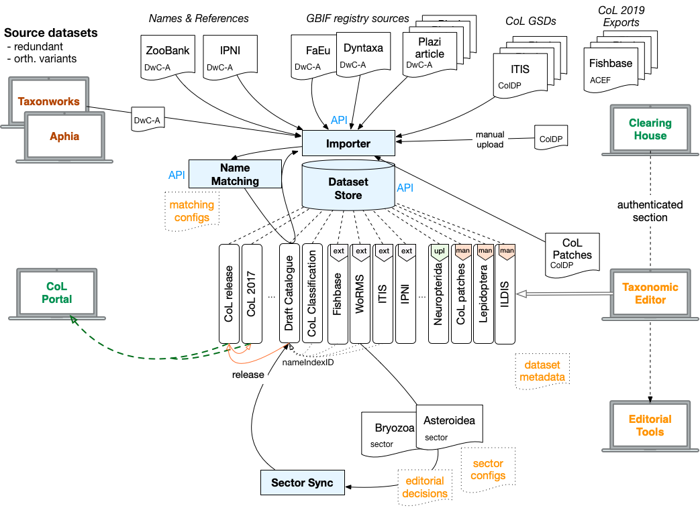

# Catalogue of Life (COL)

The [Catalogue of Life](http://www.catalogueoflife.org/) has the mission to catalogue all known species as 
an authoritative consensus taxonomy produced by the global taxonomic community. 
Up to now it has completed peer-reviewed inclusion of nearly all extant species. 

Many large institutional users (i.e. GBIF, EOL, ALA, Lifewatch) extend their copy of the catalogue with additional names and species 
to complete it to serve their own specific purpose. 
These disconnected efforts result in ‘taxonomic inconsistencies’ and cause confusion amongst users. 

The [CoL+ project](docs/CoL+slide-doc.pdf) seeks to replace these efforts with a shared, extended catalogue 
and complete the reviewed name coverage without sacrificing quality. 
Creating an open, shared, and sustainable consensus taxonomy to serve the proper linking of data in the global biodiversity information initiatives 
is the ultimate goal the project contributes to. 

**The goals** for the [Catalogue of Life Plus (CoL+) project](docs/CoL+slide-doc.pdf) are: 

 1. creating both an extended and a strictly scrutinized taxonomic catalogue to replace the current GBIF Backbone Taxonomy and Catalogue of Life
 2. separating nomenclature (facts) and taxonomy (opinion) with different identifiers and authorities for names and taxa for better reuse
 3. providing (infrastructural) support to the completion and strengthening of taxonomic and nomenclature content authorities
 4. ensuring a sustainable, robust, and more dynamic IT infrastructure for maintaining the Catalogue of Life. 

Specifically [the project](docs/project-proposal.pdf) will establish a [clearinghouse for taxonomy and nomenclature](https://data.catalogue.life) 
and rebuild all existing infrastructure of the Catalogue of Life including 
webservices, the portal and the software for the assembly of the catalogue and its editorial work.

## Partners
Catalogue of Life Plus is a collaboration between the [Catalogue of Life](http://www.catalogueoflife.org/), 
the [Global Biodiversity Information Facility Secretariat](http://www.gbif.org), 
[Naturalis Biodiversity Center](https://www.naturalis.nl/) 
and partners with financial support by the [Netherlands Biodiversity Information Facility](http://www.nlbif.nl/) 
and the Netherlands Ministry of Education, Science, and Culture. 

## A clearinghouse for taxonomy and nomenclature

Green: *Public Clearinghouse*;  Orange: *Restricted editorial access*;  Red: *External tools*

The [clearinghouse](https://data.catalogue.life) will cover [scientific names](docs/NAMES.md) across all life and provide a single taxonomic view grounded in the consensus classification of the Catalogue of Life along with provisional taxonomic sources. 
It will be based around a strict separation of nomenclature and taxonomy and allow the merging, addition and conflict resolution of data, 
completing information missing in other sources. 

Integration of data from different sources is done by relating different records to the ‘same’ name regardless of obvious spelling variations. 
Subsequent recombinations or the same binomial with a different author will be treated as distinct names. 
As a single record may ultimately be comprised of information from several sources, 
the provenance not only of the entire record but for each attribute will be tracked independently. 
A robust matching service for name strings (normally associated with some higher  classification terms which serve as hints for resolution) 
is therefore the heart of the system and should be continuously improved to give the best results possible. 
Purely automated processing will never be sufficient. As part of the editorial work, bad automatic matches can be fixed manually. 

The clearinghouse will assign persistent identifiers to both names and taxa, where available coming from existing nomenclators. 
Vernacular names, species range distributions, lifezone and fossil information will also be included to build a fully scrutinized rich catalogue. 
Community participation is desired and any record will be open for public comments. 
Areas in the taxonomic tree not governed by content authorities yet are exposed for communal editing. 
The portal will expose metrics about contributions and allow users to customize their experience by setting preferences for specific taxonomic groups. 
The clearinghouse and its [associated components](docs/ASSEMBLY.md) will replace the current [Catalogue of Life](http://www.catalogueoflife.org) software.

##  Github repositories

CoL+ manages several github repositories within the [Species 2000 organisation](https://github.com/Sp2000) which are responsible for specific tasks.
Please check the individual repositories and their issue management for more details:

 - [general](https://github.com/CatalogueOfLife/general): the overarching project repository that contains:
    - issues reaching out to the [CoL Global Team](https://github.com/CatalogueOfLife/general/issues?q=is%3Aissue+is%3Aopen+label%3A%22Global+Team%22)
 - [coldp](https://github.com/CatalogueOfLife/coldp): Catalogue of Life Data Package specification of a richer & recommended exchange format for the Clearinghouse and Catalogue of Life, replacing DwC-A and the CoL submission format (ACEF).
 - [backend](https://github.com/CatalogueOfLife/backend): the Java backend with various Maven modules that primarily provide standalone JSON webservices as shaded jars using the Dropwizard framework
    - [API documentation](https://sp2000.github.io/colplus/api/api.html) using RAML
 - [checklistbank](https://github.com/CatalogueOfLife/checklistbank): repository containing all frontend code written in [React](https://reactjs.org/) on top of the API services.
 - [portal](https://github.com/CatalogueOfLife/portal): the public facing website for Catalogue of Life built using [Jekyll](https://jekyllrb.com/)
 - [deploy](https://github.com/CatalogueOfLife/deploy): private repository with credentials and deploy scripts for GBIF
 - [data](https://github.com/CatalogueOfLife/data): a data repository that hosts DwC or ACEF archives primarily as per GSD dumps from the current CoL Assembly DB
