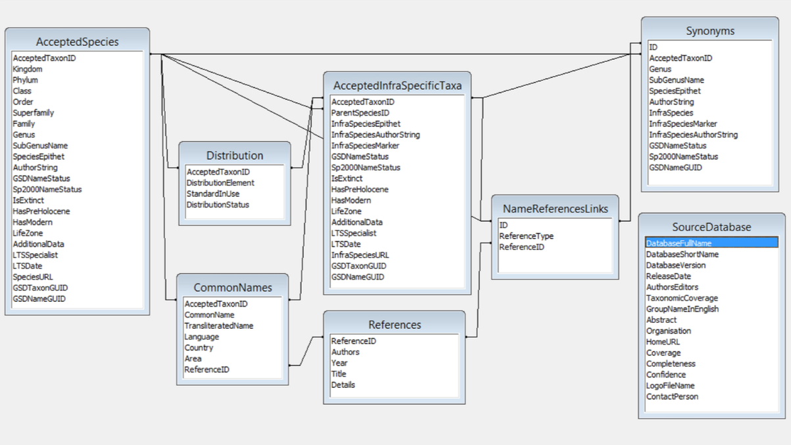

# ACEF
The [CoL Data Submission Format v.4](http://www.catalogueoflife.org/content/contributing-your-data#ACEF) (formerly known as Annual Checklist Exchange Format, ACEF) 
is supported when provided as a zipped archive of column separated files with a **header row**.
See our [general file recommendations](DATA-FORMATS.md#General_file_recommendations), 
we strongly recommended to use **TAB delimited** files encoded in **UTF-8**.

In addition to ACEF v.4 we recommend to use ´´´IsFossil´´´ and ´´´IsRecent´´´ instead of ´´´IsExtinct´´´, ´´´HasPreHolocene´´´, ´´´HasModern´´´ 
to indicate a species known from fossil records and of recent times ( ~ Holocene).

Examples of ACEF files can be found in the [CoL data repo](https://github.com/Sp2000/colplus-repo/tree/master/ACEF/assembly).

A quick summary of all supported files and columns, optional columns or files indicated by * and deprecated ones with ⚡.



## AcceptedSpecies.txt

 - AcceptedTaxonID
 - Kingdom 
 - Phylum
 - Class 
 - Order
 - Superfamily
 - Family
 - Genus
 - SubGenusName
 - SpeciesEpithet
 - AuthorString
 - GSDNameStatus
 - Sp2000NameStatus
 - ⚡ IsExtinct (bool)
 - ⚡ HasPreHolocene (bool)
 - ⚡ HasModern (bool)
 - IsFossil (bool)
 - IsRecent (bool)
 - LifeZone (terrestrial, marine, freshwater, brackish)
 - AdditionalData
 - LTSSpecialist
 - LTSDate
 - SpeciesURL
 - GSDTaxonGUID 
 - GSDNameGUID

## AcceptedInfraSpecificTaxa.txt

 - AcceptedTaxonID
 - ParentSpeciesID
 - InfraSpeciesEpithet
 - InfraSpeciesMarker
 - InfraSpeciesAuthorString
 - GSDNameStatus
 - Sp2000NameStatus
 - ⚡ IsExtinct (bool)
 - ⚡ HasPreHolocene (bool)
 - ⚡ HasModern (bool)
 - IsFossil (bool)
 - IsRecent (bool)
 - LifeZone (terrestrial, marine, freshwater, brackish)
 - AdditionalData
 - LTSSpecialist
 - LTSDate
 - InfraSpeciesURL
 - GSDTaxonGUID 
 - GSDNameGUID

## Synonyms.txt

 - ID
 - AcceptedTaxonID
 - Genus
 - SubGenusName
 - SpeciesEpithet
 - AuthorString
 - InfraSpeciesEpithet
 - InfraSpeciesMarker
 - InfraSpeciesAuthorString
 - GSDNameStatus
 - Sp2000NameStatus
 - GSDNameGUID
 
## CommonNames.txt

 - AcceptedTaxonID
 - CommonName
 - ⚡ TransliteratedName
 - Country
 - Area
 - Language
 - ReferenceID

## Distribution.txt

 - AcceptedTaxonID
 - DistributionElement (part or all of distribution area) 
 - StandardInUse (which standard schema is used, e.g. TDWG Level 4 codes, TDWG Level 3 names, FAO_ISO codes, or Text when providing free text)
 - DistributionStatus (Native, Domesticated, Alien, Uncertain)

## References.txt

 - ReferenceID 
 - Authors
 - Year
 - Title
 - Source

## NameReferecesLinks.txt

 - ID
 - ReferenceType (NomRef, TaxAccRef, ComNameRef) 
 - ReferenceID

## SourceDatabase.txt
To allow simpler manual provision of the source database metadata we alternatively allow the use of YAML instead of a TAB file.
Please use the suffix yaml or yml to indicate this in your file name as ```SourceDatabase.yaml```.

 - DatabaseFullName
 - DatabaseShortName
 - DatabaseVersion
 - ReleaseDate
 - AuthorsEditors (Authors or/and Editors) 
 - TaxonomicCoverage
 - GroupNameInEnglish
 - Abstract
 - Organisation
 - HomeURL
 - Coverage (Global/Regional)
 - Completeness (int, 0-100)
 - Confidence (1 to 5)
 - LogoFileName (either local or remote URL)
 - ContactPerson

