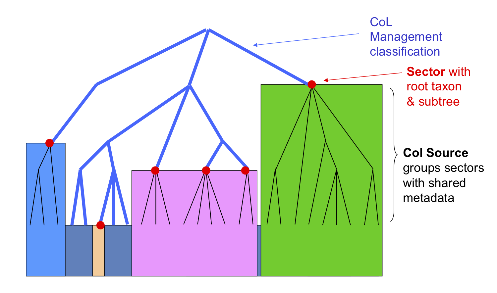

# Catalogue Assembly
The Catalogue of Life produces two aggregated catalogues that are assembled from various underlying sources. A *scrutinized catalogue* (sCat) which is stitched together from many curated, non overlapping sources, each representing a single, authoritative view on a certain taxonomic *sector*. And a *provisional catalogue* (pCat) which extends the scrutinized catalogue by adding many more names and taxa by mostly automated merging of information from a wider and overlapping range of taxonomic and nomenclatural sources.

Both of these assembly processes are semi-automated and need editorial work and reviewing in order to build a high quality catalogue. This is especially true for the scrutinized catalogue.

# Source Datasets
The first step towards the assembly of both catalogues is to get the source datasets into a common structure and to make sure there are no obvious syntactical or semantic errors. The CoL Clearinghouse is used to register URL accessible datasets in various standard formats and import them into a common database model. The Clearinghouse importer interprets literal string data into well known enumerations, objects and relations, thereby flagging rectified or detected potential problems in the entire range of basic string reading to very specific taxonomic integrity checks.

The content of each dataset in the [Clearinghouse can be browsed and searched](https://sp2000.github.io/colplus/api/api.html) on its own with the primary purpose to allow a quality assesment and detailed data review. For that reason every record also keeps track of the exact verbatim data as it came in and all fallged importing issues can be used for filters to navigate data.

## Dataset publication
Datasets that should be added to the CoL need to be accessible in a standard format from a public URL. The URL should remain the same if new versions of the dataset are published. DwC Archives and the CoL ACEF format are handled currently. It is expected to also cover TCS or newly defined formats in the future. Converting data from highly custom formats into DwC-A or ACEF is expected to be done either by the publishing source directly or with the help of the CoL data manager & the GBIF helpdesk. For sources in relational databases, Excel spreadsheets or CSVs the GBIF IPT can be used to assist in this task. 

All existing GSDs inside the CoL have been exported from the CoL global assembly database into [ACEF compliant files](https://github.com/Sp2000/colplus-repo) so that the current version of the data is immediately available even if the original sources are not yet published in a standard format. This can be repeated at any time and should at least be done once more when leaving behind the old workbench.

## Dataset registration
In order to add new datasets the URL to their data needs to be registered manually by editorial or publisher intervention. The Clearinghouse has an internal registry of datasets, but is also able to sync dataset metadata from the [GBIF registry](https://www.gbif.org/dataset/search?type=CHECKLIST). This allows to automatically keep track of new checklist datasets from IPTs or the very active [Plazi initiative](https://www.gbif.org/dataset/search?publishing_org=7ce8aef0-9e92-11dc-8738-b8a03c50a862). The ACEF data format is currently not supported in GBIF though.

Dataset registration will also include a few more settings that determine how a dataset is imported into the Clearinghouse and which can be changed at any time. Currently this includes:

 - catalogue: indicates a dataset is to be considered as a source for the scrutinized or provisional catalogue
 - type: indicates whether the dataset is primarily a nomenclator, taxonomic, national, personal or other source
 - code: the nomenclatural code context which should be applied to all data in case the dataset is restricted to a single code. This allows for better parsing and interpretation of names data in ambiguous situations.
 - importFrequency: an indication how frequently new dataset versions should be imported into the Clearinghouse

Dataset metadata will be extracted from the data if available for both ACEF and DwC-A, but can also be changed by editorial decision.

## Dataset Import
Once registered a dataset can be imported into the Clearinghouse. Imports can be triggered manually or automatically scheduled by the system, preferring datasets that have not been imported for a long time. An import queue is managed internally which can be queried and modified via the admin API.

A dataset import does many things. Most notably:
 - convert the data into the [native CoL data model](dbschema.png) with a separation of [names](NAMES.md), taxa, synonyms, name relations, distributions and references. Scientific names are parsed into their individual components.
 - normalize flat classifications into a parent child relation with a single record for higher taxa with the same name & classification
 - normalize citation strings creating a single reference for the same citation
 - generic data cleaning: resolve character encodings, replace xml, unicode or html entities, remove html tags
 - parse names into individual parts
 - flag data issues of different severity (info/warning/error). This is a large set of checks that will be continously extended. Example checks are:
    - parsed name inconsistencies
    - referential integrity problems (id terms)
    - potential chresonyms
    - duplicate names or references
    - classification loops, synonyms of synonyms, etc.
    - potential data truncation
 - match names against the names index, adding or removing names for trusted datasets
 - generate dataset import statistics: number of names by status, rank, issues etc. enabling time series for historic imports

# Assembly of the Scrutinized Catalogue
All data passes a number of steps before it ends up in the public sCat:

 1. Structural conversion of sources to standard formats
 2. Data import into the Clearinghouse
 3. Define relevant sectors from dataset and attach them to the CoL management cssification (MC)
 4. Review of sector, online report back to source, reimport revised version until aepted
 5. Assemble a preliminary sCat from accepted sectors for review
 6. Review and rebuild or release sCat

## Managing the CoL Management Classification
At the heart of the sCat lies the [management classification of the CoL](http://www.catalogueoflife.org/col/info/hierarchy). It is a special dataset in the Clearinghouse that contains a taxonomic tree down to order or even family level, may include synonyms and offers species estimates for higher groups that can be used for gap analysis and which also show up in the public portal. The MC is maintained by the CoL editorial board using a basic tree editor with species estimates forms provided by the Clearinghouse.

The MC can be seen as the backbone of the sCat where all other sources are attached to.

## Taxonomic Sectors & Col Sources
A single taxonomic group attached to the MC is called a taxonomic *sector*. A single source dataset may provide multiple sectors, e.g. Fishbase, WoRMS or ITIS. In the case of [Fishbase](http://www.catalogueoflife.org/annual-checklist/2017/details/database/id/10) the sCat groups all 6 sectors under the same umbrella, listing them all as Fishbase with the same contact and credits. This is different for larger "cluster" source like WoRMS or ITIS that provide many sectors, but like to be cited differently for most sectors, e.g. [WoRMS Bryozoa](http://www.catalogueoflife.org/annual-checklist/2017/details/database/id/81) and [WoRMS Hydrrozoa](http://www.catalogueoflife.org/annual-checklist/2017/details/database/id/112).

Sectors can therefore be grouped into CoL sources that provide common citation metadata which can be maintained by the editorial board and in absence of inputs defaults to the metadata of their parent dataset.

Selecting appropriate taxonomic sectors and mapping them to the CoL Management Classification is an important editorial decision. Taxonomic groups that should end up in the CoL need to be mapped at least once from the source datasets to the CoL management hierarchy. In the simplest case a single higher taxon from a source dataset can be placed directly onto the management classification. More control is provided to filter names & taxa in sectors by rank and allow exclusion of included groups, for example a specific genus or family because they are treated in a different source already. Nested sectors that attach and thereby replace a group in another sector is another option. Once defined, sectors will remain when the underlying dataset is updated.

## Data Review
Entire datasets or specific sectors can be reviewed to find problems and report them back to the sources. Once revised an updated dataset can simply be reimported into the Clearinghouse.

A dataset and sector summary will help identifying problems. For certain issues like duplicates or potential chresonyms a comparison view of several records is needed that allows the editor to block names from entering the Catalogue or modify their status.

Trusted sources that already have a review process implemented themselves can be marked to be included in the CoL automatically with every new dataset version imported. Otherwise manual acceptance of a new or updated sector for inclusion into the CoL needs to take place everytime through editorial decision. 

## Discussion Threads
The Clearinghouse provides generic [discussion threads](https://github.com/Sp2000/colplus/blob/master/docs/EDITORIAL-TOOLS.md#discussion-page) that consist of a description which can link out to any number of name, taxon or reference entities, status and a flat comments timeline. A discussion can be used for numerous things, e.g. to capture feedback and to communicate data issues betweem data reviewers and  data publishers. A number of names from a dataset sharing the same problem can thus be grouped as a discussion which keeps track of its state (e.g. under review, accepted, done). By using a discussion linked to records with issues we can track matching editorial decisions and recognise issues that still need editorial attention from those which have been addressed already.

## Assembling a preliminary sCat
Automatically or manually accepted sectors are copied to a preliminary sCat so they are immutable and available for subsequent Catalogues. The preliminary sCat can only by modified by replacing entire sectors or changing the management classification (MC) itself. When a sector is attached to a higher part of the management classification it becomes the authority for that part of the tree and defines the included classification which can be different from the hidden MC. 

In order to avoid tedious marking of duplicate names we propose to automatically exclude exact duplicates, i.e. the name, status & classification is identical. When the same accepted name appears with different information multiple times within the same sector or across sectors we can either block such names manually (and persist these edits for subsequent updates) or default to a priority list of sectors to be managed through editorial decision.

When a sector is copied to the preliminary Catalogue missing transliterations for vernacular names are generated automatically.

Optionally a dataset can be configured to prefer the exact name spelling from a nomenclator and to apply the objective synonyms from the nomenlcator.
    
The preliminary CoL can be browsed and searched just as any other dataset in the Clearinghouse for review before it gets released. When released it will be copied into the immutable CoL archive that drives the public portal.

# Assembling the Provisional Catalogue
Assembling a provisional Catalogue of Life with a much broader names base is done by merging many overlapping datasets onto the scrutinized catalogue. 

## Names Index
The names index is a set of unique names that powers name matching and can be used to identify the same name across different or within the same dataset. Name matching handles gender stemming and simple but common misspellings in binomials. It also does a rather fuzzy author comparison for equal binomials.

It is currently planned that the names index will be identical to the names stored in the provisional catalogue. All occurrences of a name in any matched dataset will be tracked and if none is left, e.g. because a dataset has removed or modified an erroneous name, it will also be logically deleted in the names index (note that identifiers will remain forever). As a consequence importing new datasets will potentially modify the provisional catalogue on the fly. Name relations will not be considered for the names index, just bare names. Records from nomenclators will take precedence when deciding on a canonical form for a name. Name strings which are clearly not names or classified as placeholders by the name parser will be ignored.

The status of a name can be used to indicate chresonyms or manuscript names. An editorial interface for basic name properties, initially at least the status, is provided which allows the exclusion of names from entering the final Catalogue through editorial decisions.

**TODO: Work in progress !!!**
Draft ideas to cover here: 
- micrrotaxonomy patches stored in db for overrides
- copy scrutinized cat? What about the scrut cat lagging behind because of manual review required?
- names are added dynamically as trusted datasets are imported (see names index)
- merge data about the same name based on names index match
- logically delete all names that no source contains anymore (should be done post dataset import already)
- process relevant dataset by priority, then by reverse date published (eg Plazi)
    - insert only ranks configured, default to family and below
- detect basionyms by the same epithet and authorship within families
- resolve taxonomic status, allow just one accepted name within a homotypic group

