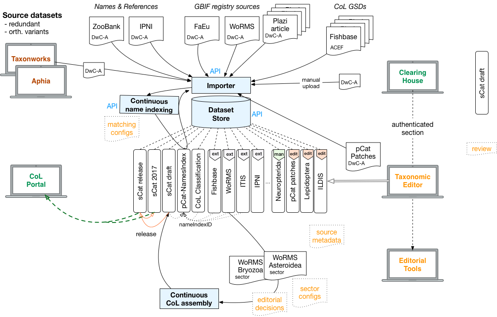
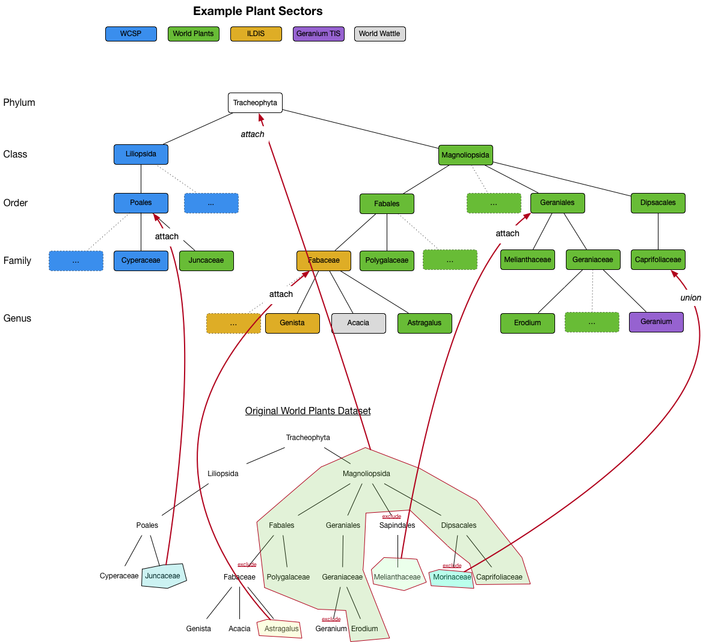

# Catalogue Assembly
The Catalogue of Life intends to produce two aggregated catalogues that are assembled from various underlying sources. A *scrutinized catalogue* (sCat, The Catalogue of Life as we know it) which is stitched together from many curated, non overlapping sources, each representing a single, authoritative view on a certain taxonomic *sector*. And an *extended catalogue* (eCat) which extends the scrutinized catalogue by adding many more names and taxa by mostly automated merging of information from a wider and overlapping range of taxonomic and nomenclatural sources.

Both of these assembly processes are semi-automated and need editorial work and reviewing in order to build a high quality catalogue. This is especially true for the scrutinized catalogue.


# Source Datasets
The first step towards the assembly of both catalogues is to get the source datasets into a common structure and to make sure there are no obvious syntactic or semantic errors. At the heart of the CoL taxonomic and names Clearinghouse is a dataset store that efficiently stores entire, self contained datasets and exposes them in a rich API. Datasets in the store can be of 3 kinds:

 - externally managed and published on a public URL
 - externally managed and manually uploaded
 - managed within the Clearinghouse using the taxonomic editor

For external datasets the CoL taxonomic and names Clearinghouse is used to register URL accessible datasets in various standard formats and import them into a common database model. The Clearinghouse importer interprets literal string data into well known enumerations, objects and relations, thereby flagging rectified or detected potential problems in the entire range of basic string reading to very specific taxonomic integrity checks.

The content of each dataset in the [Clearinghouse can be browsed and searched](https://sp2000.github.io/colplus/api/api.html) on its own with the primary purpose to allow a quality assessment and detailed data review. For that reason every record also keeps track of the exact verbatim data as it came in and all flagged importing issues can be used for filters to navigate data.




## Dataset publication
Datasets that should be added to the CoL need to be present in the dataset store.
If managed externally the data needs to be accessible in a standard format, ideally from a public URL. The URL should remain the same if new versions of the dataset are published. This allows a continuous importer to keep the version in the dataset store up to date. DwC Archives, the CoL ACEF format, and the CoL data package are handled currently. It is expected to also cover TCS or newly defined formats in the future. Converting data from highly custom formats into DwC-A or ACEF is expected to be done either by the publishing source directly or with the help of the CoL data manager & the GBIF helpdesk. For sources in relational databases, Excel spreadsheets or CSVs the GBIF IPT can be used to assist in this task. 

All existing GSDs inside the CoL have been exported from the CoL global assembly database into [ACEF compliant files](https://github.com/Sp2000/colplus-repo) so that the current version of the data is immediately available even if the original sources are not yet published in a standard format. This can be repeated at any time and should at least be done once more when leaving behind the old workbench.


## Dataset registration
In order to add new datasets the URL to their data needs to be registered manually by editorial or publisher intervention. The Clearinghouse has an internal registry of datasets, but is also able to sync dataset metadata from the [GBIF registry](https://www.gbif.org/dataset/search?type=CHECKLIST). This allows to automatically keep track of new checklist datasets from IPTs or the very active [Plazi initiative](https://www.gbif.org/dataset/search?publishing_org=7ce8aef0-9e92-11dc-8738-b8a03c50a862). The ACEF data format and Catalogue of Life Data Package are currently not supported in GBIF though.

Dataset registration will also include a few more settings that determine how a dataset is imported into the Clearinghouse and which can be changed at any time. Currently this includes:

 - catalogue: indicates a dataset is to be considered as a source for the scrutinized or extended catalogue
 - [type](https://github.com/Sp2000/colplus-backend/blob/master/colplus-api/src/main/java/org/col/api/vocab/DatasetType.java): indicates the primary focus of a dataset; whether it is primarily a nomenclatural list, a global or regional taxonomic checklist, a personal uploaded list of names or something else (e.g. a list of type specimens, paper on ecology of North Sea, Red List, etc.)
 - [code](https://github.com/gbif/name-parser/blob/master/name-parser-api/src/main/java/org/gbif/nameparser/api/NomCode.java#L29): the nomenclatural code context which should be applied to all data in case the dataset is restricted to a single code. This allows for better parsing and interpretation of names data in ambiguous situations.
 - importFrequency: an indication how frequently new dataset versions should be imported into the Clearinghouse

Dataset metadata will be extracted from the data if available for ACEF, DwC-A and CoLdp, but can also be changed by editorial decision.

## Dataset Import
Once registered a dataset can be imported into the Clearinghouse. Imports can be triggered manually or automatically scheduled by the system, preferring datasets that have not been imported for a long time. An import queue is managed internally which can be queried and modified via the admin API.

A dataset import does many things. Most notably:
 - convert the data into the [native CoL data model](dbschema.png) with a separation of [names](NAMES.md), taxa, synonyms, name relations, distributions and references. Scientific names are parsed into their individual components.
 - [unescape character entities](https://github.com/Sp2000/colplus-backend/issues/60) in raw data
 - normalize flat classifications into a parent child relation with a single record for higher taxa with the same name & classification
 - normalize citation strings creating a single reference for the same citation
 - generic data cleaning: resolve character encodings, replace xml, unicode or html entities, remove html tags
 - parse names into individual parts
 - flag data issues of different severity (info/warning/error). This is a large set of checks that will be [continuously extended](https://github.com/Sp2000/colplus-backend/issues?q=is%3Aissue+label%3A%22issue+rules%22). Example checks are:
    - parsed name inconsistencies
    - referential integrity problems (id terms)
    - [potential chresonyms](https://github.com/Sp2000/colplus-backend/issues/117)
    - duplicate names or references
    - classification loops, synonyms of synonyms, etc.
    - [potential data truncation](https://github.com/Sp2000/colplus-backend/issues/120)
 - match names against the names index, adding or removing names for trusted datasets
 - generate dataset import statistics: number of names by status, rank, issues etc. enabling time series for historic imports. Track [diffs of all names](https://github.com/Sp2000/colplus-backend/issues/138)  between versions


## Taxonomic Editor
It is proposed to implement a basic taxonomic editor that allows a community of users to manage a dataset in the Clearinghouse. This editor can therefore also be used to manage the names index and apply final changes to the CoL before it is released.

The editor is meant to be basic and should leave all decisions, restrictions and checks to the users at this stage. Manipulation of names, their relations, taxa & synonyms, vernacular names and distributions will be possible. To get started data archives can be uploaded. For subsequent bulk uploads datasets can be merged. This allows a user to upload data into a new dataset, review it, apply small fixes or remove unused parts and finally merge it into his main dataset.

Initially data is not expected to be versioned.


# Assembly of the Scrutinized Catalogue
All data passes a number of steps before it ends up in the public Catalogue of Life (sCat):

 1. Structural conversion of sources to standard formats
 2. Data import into the Clearinghouse with data interpretations & issue flagging
 3. Define relevant sectors from dataset and attach them to the CoL management classification (MC)
 4. Review of sector including duplicate detection across all sectors, online report back to editors and data providers, fixes in the source dataset and reimport revised version until accepted or with a scheduled new update
 5. Review of draft sCat by editorial board and data providers. Final adhoc fixes via taxonomic editor.
 6. Release sCat, archiving previous release

## Managing the CoL Management Classification
At the heart of the sCat lies the [management classification of the CoL](http://www.catalogueoflife.org/col/info/hierarchy). It is a special dataset in the Clearinghouse that contains a taxonomic tree down to order or family level which acts as the default classification for the CoL. It may include synonyms and offers species estimates for higher groups which show up in the public portal and can be used for gap analysis by comparing them with actual species contained in the CoL. 

The MC is maintained by the CoL editorial board using the taxonomic editor provided by the Clearinghouse. It can be seen as the backbone of the sCat where all other sources are attached to.


## Taxonomic Sectors & Col Sources
A single taxonomic group attached to the MC is called a taxonomic *sector*. A single source dataset may provide multiple sectors, e.g. Fishbase, WoRMS or ITIS. In the case of [Fishbase](http://www.catalogueoflife.org/annual-checklist/2017/details/database/id/10) the sCat groups all 6 sectors under the same umbrella, listing them all as Fishbase with the same contact and credits. This is different for larger "cluster" source like WoRMS or ITIS that provide many sectors, but like to be cited differently for most sectors, e.g. [WoRMS Bryozoa](http://www.catalogueoflife.org/annual-checklist/2017/details/database/id/81) and [WoRMS Hydrozoa](http://www.catalogueoflife.org/annual-checklist/2017/details/database/id/112).

Sectors can therefore be grouped into CoL sources that provide common citation metadata which can be maintained by the editorial board and in absence of inputs defaults to the metadata of their parent dataset.

Selecting appropriate taxonomic sectors and mapping them to the CoL Management Classification is an important editorial decision. Taxonomic groups that should end up in the CoL need to be mapped at least once from the source datasets to the CoL management classification. In the simplest case a single higher taxon from a source dataset can be placed directly onto the management classification. More control is provided to filter names & taxa in sectors by rank and allow exclusion of included groups, for example a specific genus or family because they are treated in a different source already. Nested sectors that attach and thereby replace a group in another sector is another option, even down to the level of species when assembling a genus from various sources thus effectively creating a new *ProtoGSD*. Once defined, sectors will remain when the underlying dataset is updated.

### Example: Plant Sectors
Plants in the CoL come mostly from two major sources. [World Plants (WP)](http://www.catalogueoflife.org/annual-checklist/2017/details/database/id/141) & [Ferns (WF)]() contributing roughly 294 families and 166.700 species. And Kews [World Checklist of Selected Plant Families (WCSP)](http://www.catalogueoflife.org/annual-checklist/2017/details/database/id/24) contributing 113 families and 112.000 species with global coverage as of 2017. WSCP provides nearly all Monocots (Liliopsida in CoL) while WP provides the majority of the Dicots (Magnoliopsida). CoL follows the [APG IV](https://en.wikipedia.org/wiki/APG_IV_system) system which at least in 2017 was not entirely followed by WP. This requires an editorial change in the classification for some parts. Apart from those 2 large sources there are about 12 smaller datasets contributing to specific areas, e.g. the Spanish [Geranium Taxonomic Information System](http://www.catalogueoflife.org/annual-checklist/2017/details/database/id/48) which provides the single genus Geranium or [ILDIS](http://www.catalogueoflife.org/annual-checklist/2017/details/database/id/15) for the Fabaceae.

Currently parts of WP are deleted or their family classification is changed to match APG IV. This is done in [workbench scripts](https://github.com/Sp2000/workbench_scripts/blob/master/home/GSDS/World_Plants/settings/d_local_editorial_transformations.sql) modifying the assembly database directly, e.g. the entire family *Morinaceae* is moved to *Caprifoliaceae*:

```
# change entire families
# Morinaceae -> Caprifoliaceae
UPDATE scientific_names SET family_code = (SELECT family_code FROM families WHERE family = "Caprifoliaceae") WHERE family_code IN(SELECT family_code FROM families WHERE family LIKE "Morinaceae%");
DELETE FROM families WHERE family LIKE "Morinaceae%";

# update orders for APG IV for certain families
UPDATE families SET `order`="Fabales" WHERE family = "Polygalaceae";
UPDATE families SET `order`="Geraniales" WHERE family = "Geraniaceae";
UPDATE families SET `order`="Geraniales" WHERE family = "Melianthaceae";
```

In the Clearinghouse we would like to retain the original data and configure explicit sector mappings to stitch together an APG IV compliant taxonomy. A possible scenario could look like this:



Alternatively if the sources deviate a lot from APG IV this might be better done by having a dedicated [APG IV source](https://github.com/Sp2000/dwca-apg) which the World Plants orders or families are then attached to.


## Data Review
Entire datasets or specific sectors can be reviewed to find problems and report them back to the data provider. Once revised at the source the updated dataset can be reimported into the Clearinghouse. 

A dataset and sector summary will help identifying problems. For certain issues like duplicates or potential chresonyms a comparison view of several names is needed that allows the editor to block names from entering the Catalogue, modify their status or provide a [minor orthographic correction](https://github.com/Sp2000/colplus-backend/issues/139) (e.g. misspelled genus name in a single binomial; misspelled species epithet ("crista galli" ->  "crista-galli"); misspelled species author; etc.).

Trusted sources that already have a review process implemented themselves can be marked to be included in the CoL automatically with every new dataset version imported. However, those automated datasets should pass data integrity checks with each update and detected cases should be reported to the CoL editor and data provider for correction in the source database. In some cases, manual acceptance of updated sectors for inclusion into the CoL needs to take place everytime through an editorial decision. A new sector (i.e. "sister taxon") from an existing data provider always requires manual acceptance by creating that new sector. A newly added child in the accepted sector does not need manual acceptance. For example, if WoRMS contains a sector providing the phylum Mollusca, there is no need for manual acceptance of growing number of children even at higher ranks like classes, orders, etc. 

However, at a particular stage of WoRMS Mollusca growth, the Clearinghouse should detect and report overlap with extinct taxa originating from PaleoBioDB. Editorial decisions will then be needed on whether to block order †Ammonoidea from WoRMS Mollusca and continue taking it from PaleoBioDB, or switch to WoRMS Mollusca as an authorised provider for ammonits, thereby deleting the previous PaleoBioDB data from the CoL. 

The Extended Catalogue of Life (eCat) could also be used to create sectors if they have passed a review and were recommended by the Taxonomy Group and CoL Editorial Board to fill gap areas, or as a replacement for existing Proto GSDs. It does create a [circular dependency](https://github.com/Sp2000/colplus-backend/issues/140) though which needs to be addressed.

## Discussion Threads
The Clearinghouse provides generic [discussion threads](https://github.com/Sp2000/colplus/blob/master/docs/EDITORIAL-TOOLS.md#discussion-page) that consist of a description which can link out to any number of name, taxon or reference entities, status and a flat comments timeline. A discussion can be used for numerous things, e.g. to capture feedback and to communicate data issues betweem data reviewers and  data providers.

A number of names from a dataset sharing the same problem can thus be grouped as a discussion which keeps track of its state (e.g. under review, accepted, done). By using a discussion linked to records with issues we can track matching editorial decisions and recognise issues that still need editorial attention from those which have been addressed already. 

## The sCat draft
A draft sCat is always kept up to date with all configured sectors and editorial decisions. This provides the editorial board with a full dataset representing the latest version of the assembly. Whenever a new sector is mapped, its definitions changed or editorial decisions are added or removed the draft will be updated asyncroneously, always reporting whether its in sync with all decisions.

When a sector is attached to a higher part of the management classification it becomes the authority for that part of the tree and defines the included classification which can be different from the then hidden MC. 

When updated data in the underlying datasets of sectors is available the editor will be notified and asked to also update the respective sectors in the sCat draft. This leaves all control with the editor who can decide to include updates immediately or at a later stage.

When a sector is copied to the draft Catalogue missing transliterations for vernacular names are generated automatically. Chresonyms, manuscript and placeholder names known by the [Names Index](#names-index) are ignored and not copied to the sCat.

Optionally a CoL source can be configured to prefer the exact name spelling from a nomenclator and to apply its objective synonymy.
    
The draft CoL can be browsed and searched for review just as any other dataset in the Clearinghouse, but also in a preview portal similar to the main public one before it gets released. 

Before releasing the draft final edits can be applied using the taxonomic editor. This enables the editor to apply small fixes without waiting for an updated source dataset which can delay publication considerably. Usually such changes are in agreement with the data provider. As these final edits can be anywhere in the data they will not be recorded like sector definitions or main editorial decisions. This means they will be lost and get overwritten when a sector is updated from its underlying source.

When released a new immutable dataset is created which will feed the public portal and the last release will be archived as a regular dataset which can be accessed.


# Assembling the Extended Catalogue
Assembling an Extended Catalogue of Life (eCat) with a much broader names base is done by merging many overlapping datasets onto the scrutinized catalogue. 


## Names Index
The names index is a set of unique names that powers name matching and can be used to identify the same name across different or within the same dataset. Name matching handles gender stemming and simple but common misspellings in binomials. It also does a rather fuzzy author comparison for equal binomials.

It is currently planned that the names index will be identical to the names stored in the provisional catalogue. All occurrences of a name in any matched dataset will be tracked and if none is left, e.g. because a dataset has removed or modified an erroneous name, it will also be logically deleted in the names index (note that identifiers will remain forever). As a consequence importing new datasets will potentially modify the provisional catalogue on the fly. Name relations will not be considered for the names index, just bare names. Records from nomenclators will take precedence when deciding on a canonical form for a name. Name strings which are clearly not names or classified as placeholders by the name parser will be ignored.

The status of a name can be used to indicate chresonyms or manuscript names. An editorial interface for basic name properties, initially at least the status, is provided which allows the exclusion of names from entering the final Catalogue through editorial decisions.


**TODO: Work in progress !!!**
Draft ideas to cover here: 
- microtaxonomy patches stored in db for sCat and source overrides
- copy scrutinized cat? What about the scrut cat lagging behind because of manual review required?
- names are added dynamically as trusted datasets are imported (see names index)
- merge data about the same name based on names index match
- logically delete all names that no source contains anymore (should be done post dataset import already)
- process relevant dataset by priority, then by reverse date published (eg Plazi)
    - insert only ranks configured, default to family and below
- detect basionyms by the same epithet and authorship within families
- resolve taxonomic status, allow just one accepted name within a homotypic group

