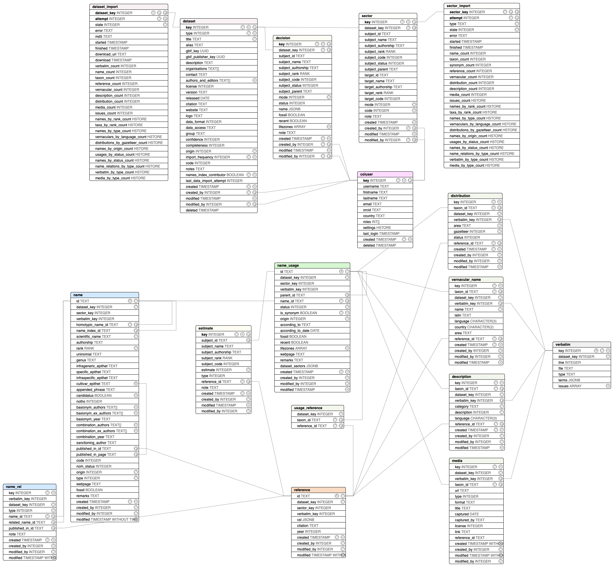

# CoL+ System Design

This document lays out the planned features of the different parts of the Clearinghouse.
Some high level technology choices are included where deemed important.

This document is meant to explain and give context to the the wording used 
in the project [milestones](https://github.com/Sp2000/colplus/milestones?direction=asc&sort=due_date).

## API definition

- [api model classes](https://github.com/Sp2000/colplus-backend/tree/master/colplus-api) 

## Datastore
The dataset store is the core of the system storing all names, taxa, references and associated data in its verbatim form in a PostgreSQL database.
In addition to the strictly verbatim data an interpreted view of the API classes is derived which then drives the public JSON API. 
All data from a single dataset is kept in isolation and can be searched and browsed publicly.

The Datastore will also be the home to the final Catalogue of Life and all its versions.

### Database schema & access
PostgreSQL 10 is used with MyBatis to map model classes to the database schema:

[dbschema.sql](https://github.com/Sp2000/colplus-backend/blob/master/colplus-dao/src/main/resources/org/col/db/dbschema.sql)

### Public webservices
The public API will be deployed standalone as a shaded jar using the Java Dropwizard framework.
Important items of work inlcude:

- dropwizard app & customized Jackson serlaization
- GBIF deployment: http://api.col.plus
- GBIF central logging: https://logs.gbif.org/goto/f48b16293f49e7b08a48c68388474319

### Importer
An importer process separate from the public services reads registered DwC or ACEF archives, places them into an internal Neo4J database where it is normalized to conform to CoL+ specific vocabularies.
Records are flagged with problems detected during this interpretation step. 
Relations between entities and flat classifications are normalised in Neo4j before all data is inserted into the Datastore after it has passed basic validations.

Features of the importer as planned so far:

- DWCA format support
- ACEF format support
- derive nomencaltural acts from publication reference
- parse references into CSL-JSON
- issues flagging
- name parsing
- date parsing
- vocab parsing
- charset detection
- character unescaping in raw data
- transliterations of vernacular names in non latin scripts

### Clearinghouse UI 
- exposes all of the Dataset Store API

## Names Index
- name matching API
- maps name strings and parsed names to name ids
- simple store for (parsed) name strings only, not acts, authors, references, etc
- API to merge/split name IDs

## Editorial tools
extends the CH-UI and dataset store with editorial tools for the CoL assembly:

- dataset metadata CRUD forms, add new GBIF checklist key
- sector configuration
  - attach source taxa to CoL tree
  - configure exclusions (names, taxa & vernaculars)
  - nomenclator override settings
  - cluster as single source dataset if possible
- species estimate forms
- names index browser with merge/split forms

## Catalogue Assembly
Based on the configured sectors a Catalogue can be assembled.

TODO:
- 1 name per homonym/nameID
- nomenclatural augmentation settings

## CoL Archive
Extends the dataset store with features needed for CoL releases
to archive versions and track data provenance.

## User accounts
Registration, management, password recovery and general authentication to the Clearinghouse portal

## Comments API
Allow unstructured comments for authenticated useds.

- unstructed comments on names, taxa, references, dataset
- generic issue/feature request capturing on any page

## Taxon Index
Similar to the names index unique taxon concepts should be tracked and given a stable id.
A taxon concept matching service is created that is used by the importer to assign concept ids to processed datasets, 
allowing to identify all concepts which are the same across all sources.

The taxon index must track all concepts in the datastore including concepts not part of the CoL.
